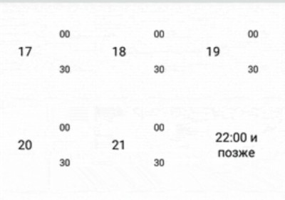
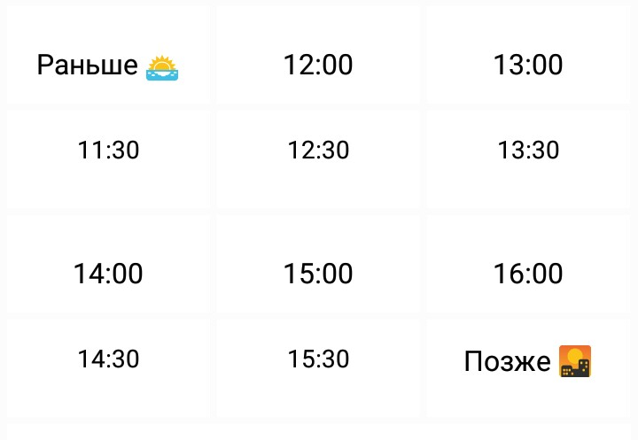

<h4>Comparing</h4>
<h2>Telegram and Viber</h3>
<h4>bots</h4>

---

@[intro]
<h2>Why bot?</h2>
@ul
 * Mobile app is too heavy solution.
 * It is not getting lost when using it one a month.
 * It knows your phone number.
@ulend
---

<h1>Configuration</h1>

+++

@[Bot Father vs Web-Mobile-Nothing]

<h2>Create it!</h2>

@div[left-50]
<h1>tg</h1>
<h2>Bot Father</h2>
@divend

@div[right-50]
<h1>viber</h1>
<h2>Web-Mobile-Nothing</h2>
@divend

+++

@[https]

<h2>https</h2>

@div[left-50]
<h1>tg</h1>
<h2>Self-signed certificate</h2>

@divend

@div[right-50]
<h1>viber</h1>
<h2>CA</h2>
@divend

+++

@[how-to-communicate]

<h2>Communication</h2>

@div[left-50]
<h1>tg</h1>

@ul
 - webhook -> response
 - webhook -> callback
 - long poll -> callback
@ulend

@divend

@div[right-50]
<h1>viber</h1>

@ul
 * webhook -> callback 
 * only 
 * almost only...
@ulend

@divend

+++

@[client]

<h2>How to use it?</h2>

@div[left-50]
<h1>tg</h1>
@ul
 - mobile
 - desktop
 - web
@ulend
@divend

@div[right-50]
<h1>viber</h1>
@ul
 * mobile
 * only  
@ulend
@divend

---

<h1>API</h1>
<h5>Data structure</h5>

+++

@[Documentation]

<h2>Documentation</h2>

@div[left-50]
<h1>tg</h1>
@ul
 - consistent
 - browsable (with anchor links to data types)
 - big plain message
@ulend
@divend

@div[right-50]
<h1>viber</h1>
@ul
 * ad hoc (?)
 * non-browsable
 * different types of message (as declared)
@ulend
@divend

+++

<h4>Outcomming example</h4>
```
{
   "receiver":"01234567890A=",
   "min_api_version":1,
   "sender":{
      "name":"John McClane",
      "avatar":"http://avatar.example.com"
   },
   "tracking_data":"tracking data",
   "type":"text",
   "text":"Hello world!"
}
```
@[2]
@[3]
@[4-7]
@[8]
@[9]
@[10]

+++

<h4>Incomming example</h4>
```
{
   "event":"message",
   "timestamp":1457764197627,
   "message_token":4912661846655238145,
   "sender":{
      "id":"01234567890A=",
      "name":"John McClane",
      "avatar":"http://avatar.example.com",
      "country":"UK",
      "language":"en",
      "api_version":1
   },
   "message":{
      "type":"text",
      "text":"a message to the service",      
      "tracking_data":"tracking data"
   }
}
```
@[2,14,15]
@[6]
@[16]

+++

Text

```
{
   "receiver":"01234567890A=",
   "sender":{
      "name":"John McClane"
   },
   "type":"text",
   "text":"Hello world!"
}
```
@[6-7]

+++

File

```
{  
   "receiver":"01234567890A=",
   "sender":{  
      "name":"John McClane",
   },
   "type":"file",
   "media":"http://www.images.com/file.doc",
   "size":10000,
   "file_name":"name_of_file.doc"
}
```
@[6-9]

+++

Contact

```
{
   "receiver":"01234567890A=",
   "sender":{
      "name":"John McClane",
   },
   "type":"contact",
   "contact":{
      "name":"Itamar",
      "phone_number":"+972511123123"
   }
}
```
@[6-10]

+++

Location

```
{
   "receiver":"01234567890A=",
   "sender":{
      "name":"John McClane",
   },
   "type":"location",
   "location":{
      "lat":"37.7898",
      "lon":"-122.3942"
   }
}
```
@[6-11]

+++

Also `Picture`, `Video`, `URL`, `Sticker` and `rich-media`

+++

<h5> How do they propose to handle it with python? </h5>

```
# this library supplies a simple way to receive a request object
viber_request = viber.parse_request(request.get_data())

if isinstance(viber_request, ViberMessageRequest):
    message = viber_request.message
    # lets echo back
    viber.send_messages(viber_request.sender.id, [
        message
    ])
elif isinstance(viber_request, ViberSubscribedRequest):
    viber.send_messages(viber_request.get_user.id, [
        TextMessage(text="thanks for subscribing!")
    ])
elif isinstance(viber_request, ViberFailedRequest):
    logger.warn("client failed receiving message. failure: {0}".format(viber_request))
```
@[1-2]
@[10]

+++

<h4>Viber, why?</h4>

@div[left-50]
<h1>tg</h1>
@ul
 - Bot Father message
 - Reusable connection in python client
@ulend
@divend

@div[right-50]
<h1>viber</h1>
@ul
 * Response message
 * <b>user</b> keyword instead of <b>sender</b>
 * requests.post
@ulend
@divend

+++

<h5> Quote from official docs </h5>

@ul
 * The account receives the `conversation_started` and **responds** with an HTTP response which includes the welcome message as the **response body**.
 * ...
 * An example welcome message would look like this:
@ulend 

+++

```
@app.route('/', methods=['POST'])
def incoming():
	   viber_request = viber.parse_request(request.get_data())

	   if isinstance(viber_request, ViberConversationStartedRequest) :
		      viber.send_messages(viber_request.get_user().get_id(), [
			         TextMessage(text="Welcome!")
		      ])

	   return Response(status=200)
```
@[10]

+++

<h5> What it really looks like </h5>

```
if remote_update.event == defines.EVENT_TYPE_CONVERSATION_STARTED:
    if not remote_update.subscribed:
	return web.json_response({
	    'text': _('This is a bot for booking Mogilev-Minsk minibusses.\n'
		      'Choose the date, time and book your trip!\n'
		      'Notice:\n\U0001f690 - bookable directly from bot.\n'
		      '\U0001f4de - you have to make a call to book your trip.\n'),
	    'type': 'text',
	    'min_api_version': 4,
	    "keyboard": {
		"Type": "keyboard",
		'InputFieldState': 'hidden',
		"Buttons": [{
			"ActionType": "open-url",
			"ActionBody": "https://rate.pautuzin.by/static/viber_intro.gif?v=2",
			"Text": _("Take a quick animated tour"),
			'OpenURLMediaType': 'gif',
		     },
		],
	    },
      }, dumps=lazy_string_aware_json_dumps)
```
@[2]
@[4-7]
@[8]
@[9]
@[10-20]
@[12]
@[14,17]
@[15-16]

+++


---
@[Keyboards]

<h2>Keyboards</h2>

@div[left-50]
<h1>tg</h1>
@ul
 - Not customizable 
 - Text button vs inline button
@ulend
@divend

@div[right-50]
<h1>viber</h1>
@ul
 * Infinite customization
 * Text-AND-callback buttons
 * Hide text input
@ulend
@divend

+++

<h5>(Almost) minimal example</h5>
```
{
   "receiver":"01234567890A=",
   "type":"text",
   "text":"Hello world",
   "keyboard":{
      "Type":"keyboard",
      "Buttons":[
         {
            "ActionType":"reply",
            "ActionBody":"reply to me",
            "Text":"Key text",
         }
      ]
   }
}
```
@[9,11]
@[10]

+++

<h5> Button grid </h5>


+++

<h5> Do anything you want </h5>

```
{
	"Type": "keyboard",
	"Buttons": [{
		"Columns": 3,
		"Rows": 2,
		"Text": "<font color=\"#494E67\">Smoking</font><br><br>",
		"TextSize": "medium",
		"TextHAlign": "center",
		"TextVAlign": "bottom",
		"ActionType": "reply",
		"ActionBody": "Smoking",
		"BgColor": "#f7bb3f",
		"Image": "https: //s12.postimg.org/ti4alty19/smoke.png"
	}, {
		"Columns": 3,
		"Rows": 2,
		...
	}
```
@[4,5]
@[6]
@[7]
@[8-9]
@[10-11]
@[12]
@[13]

+++

<h5> What we got? </h5>


+++

<h5> What I got ? </h5>




+++

<h5> For example... </h5>

* BgColor
* BgMedia
* BgLoop
* TextVAlign/TextHAlign
* TextPaddings
* TextOpacity
* TextSize
* OpenURLType (internal, external)
* OpenURLMediaType (not-media , video , gif , picture)

+++

<h5> And most important </h5>

* ActionType (reply, open-url, location-picker, share-phone, none)
* ActionBody
 
+++


+++


+++


+++


+++

That was only buttons. But I told nothing about **rich-media** messages...


+++
<h6>Viber. Great and useless.</h6>
<h6>Skype. Great and useless.</h6>
<h6>Telegram...</h6>


---

<h4>Comparing</h4>
<h2>Telegram and Viber</h3>
<h4>bots</h4>


<h6>Viber: https://mm.pautuzin.by/viber</h6>
<h6>Tg: @mogminskbot</h6>
